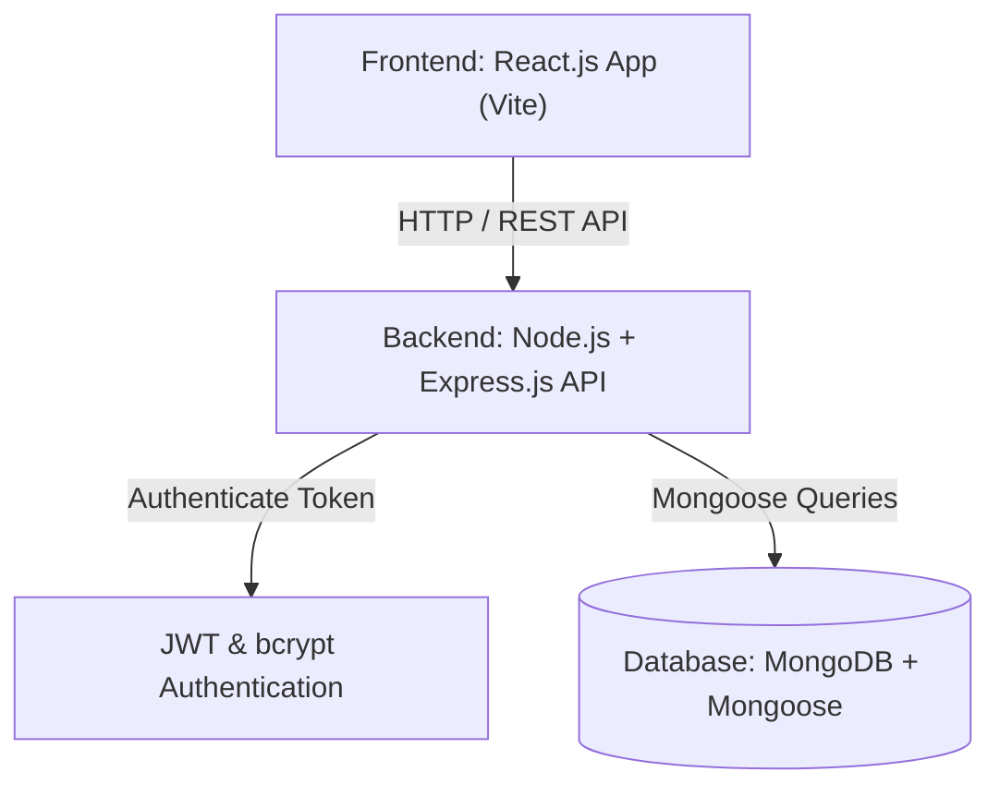
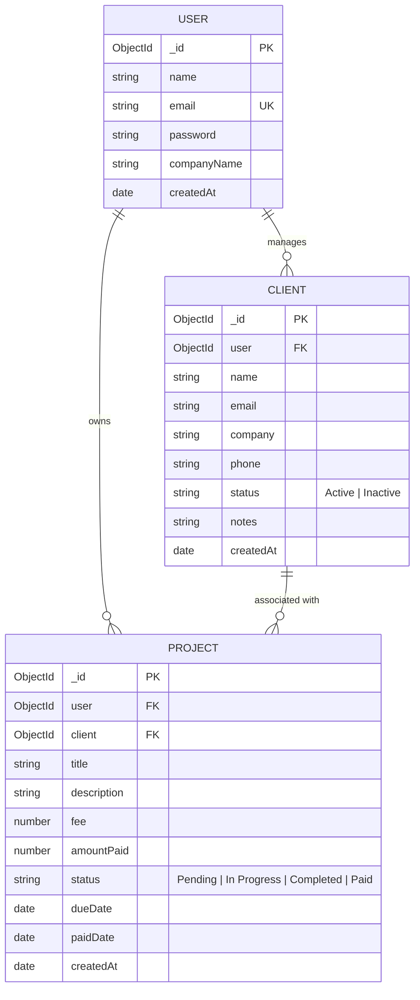

# 📌 Freelancer Project & Income Tracker
## Phase 1: Planning, Repository Setup & Database Modeling

---

## 🎯 1. System Architecture & Requirements Planning

The **Freelancer Project & Income Tracker** is a full-stack MERN application designed to help freelancers track client relationships, manage active projects, and monitor income flow with visual data charts.



### Key Technical Requirements
- **Frontend**: React.js, React Router, Recharts, Lucide Icons
- **Backend**: Node.js & Express RESTful API
- **Database**: MongoDB with Mongoose Schemas & Data Validation
- **Security**: JWT Authentication & `bcryptjs` password hashing
- **Version Control**: Git & GitHub repository with incremental commits

---

## 📁 2. Repository Setup & Folder Structure

```text
freelancer-tracker/
├── backend/
│   ├── config/
│   │   └── db.js                 # Mongoose MongoDB connection module
│   ├── controllers/
│   │   ├── authController.js     # User registration, login, profile logic
│   │   ├── clientController.js   # Client CRUD management logic
│   │   └── projectController.js  # Project CRUD & Dashboard metrics calculations
│   ├── middleware/
│   │   └── authMiddleware.js     # JWT Bearer token validation middleware
│   ├── models/
│   │   ├── User.js               # Mongoose User model & bcrypt hooks
│   │   ├── Client.js             # Mongoose Client model
│   │   └── Project.js            # Mongoose Project & Income tracking model
│   ├── routes/
│   │   ├── authRoutes.js         # /api/auth endpoints
│   │   ├── clientRoutes.js       # /api/clients endpoints
│   │   └── projectRoutes.js      # /api/projects endpoints
│   ├── .env                      # Environment variables (PORT, MONGO_URI, JWT_SECRET)
│   ├── package.json              # Backend dependencies & dev scripts
│   └── server.js                 # Main Express server entry point
├── frontend/                     # React Single Page Application (Vite framework)
│   ├── src/
│   │   ├── components/           # Navbar, Sidebar, StatCards, Modals, Charts
│   │   ├── context/              # AuthContext (JWT state management)
│   │   ├── pages/                # Login, Register, Dashboard, Projects, Clients
│   │   ├── App.jsx
│   │   └── main.jsx
│   └── package.json
└── README.md                     # Project documentation & setup instructions
```

---

## 🗄️ 3. Database Modeling & Entity-Relationship (ER) Schema

The database consists of **3 interconnected Mongoose schemas**: `User`, `Client`, and `Project`.

### Entity-Relationship Diagram



---

### Mongoose Models Breakdown

#### 1. User Schema ([User.js](file:///d:/Intern%20Project/4th%20Project/backend/models/User.js))
- **Purpose**: Stores freelancer login & profile information.
- **Security Features**:
  - Pre-save hook using `bcryptjs` with salt factor 10 to hash raw passwords automatically.
  - Instance method `matchPassword()` for secure password verification on login.

```javascript
const userSchema = new mongoose.Schema({
  name: { type: String, required: true, trim: true },
  email: { type: String, required: true, unique: true, lowercase: true, trim: true },
  password: { type: String, required: true, minlength: 6 },
  companyName: { type: String, default: '' },
}, { timestamps: true });
```

#### 2. Client Schema ([Client.js](file:///d:/Intern%20Project/4th%20Project/backend/models/Client.js))
- **Purpose**: Stores freelancer client contact details.
- **Relational Link**: Referenced to `User` via `user` ObjectId so each freelancer sees only their clients.

```javascript
const clientSchema = new mongoose.Schema({
  user: { type: mongoose.Schema.Types.ObjectId, ref: 'User', required: true },
  name: { type: String, required: true, trim: true },
  email: { type: String, trim: true },
  company: { type: String, trim: true },
  phone: { type: String, trim: true },
  status: { type: String, enum: ['Active', 'Inactive'], default: 'Active' },
  notes: { type: String, default: '' },
}, { timestamps: true });
```

#### 3. Project & Income Schema ([Project.js](file:///d:/Intern%20Project/4th%20Project/backend/models/Project.js))
- **Purpose**: Tracks project status, deadlines, and financial fee/income data.
- **Relational Links**: References `User` and `Client`.
- **Status Lifecycle**: `Pending` ➔ `In Progress` ➔ `Completed` ➔ `Paid`.

```javascript
const projectSchema = new mongoose.Schema({
  user: { type: mongoose.Schema.Types.ObjectId, ref: 'User', required: true },
  client: { type: mongoose.Schema.Types.ObjectId, ref: 'Client', required: true },
  title: { type: String, required: true, trim: true },
  description: { type: String, default: '' },
  fee: { type: Number, required: true, min: 0 },
  amountPaid: { type: Number, default: 0, min: 0 },
  status: {
    type: String,
    enum: ['Pending', 'In Progress', 'Completed', 'Paid'],
    default: 'Pending',
  },
  dueDate: { type: Date },
  paidDate: { type: Date },
}, { timestamps: true });
```

---

## 🔄 4. API Endpoints & Data Flow Design

### Authentication Endpoints
- `POST /api/auth/register` — Create a new user account & return JWT token
- `POST /api/auth/login` — Authenticate user credentials & return JWT token
- `GET /api/auth/me` — Return profile of currently logged-in user (Protected)

### Client Management Endpoints
- `GET /api/clients` — Fetch all clients belonging to the authenticated user
- `POST /api/clients` — Add a new client
- `PUT /api/clients/:id` — Update existing client details
- `DELETE /api/clients/:id` — Remove client & associated project records

### Project & Dashboard Endpoints
- `GET /api/projects` — Fetch projects with filter by `status`, `client`, and `search` term
- `POST /api/projects` — Create project entry
- `PUT /api/projects/:id` — Update project status, fee, or dates
- `DELETE /api/projects/:id` — Delete project entry
- `GET /api/projects/stats` — Calculate summary metrics: Total Income, Pending Payments, Active Projects Count, Monthly income aggregation, Status distribution

---

## 🛠️ 5. How to Run & Verify Phase 1 Setup

### 1️⃣ Initialize Git Repository
```bash
git init
git add .
git commit -m "feat: complete Phase 1 planning, backend setup & database modeling"
```

### 2️⃣ Configure Environment Variables
Verify your [backend/.env](file:///d:/Intern%20Project/4th%20Project/backend/.env) file:
```env
PORT=5000
MONGO_URI=mongodb://127.0.0.1:27017/freelancer_tracker
JWT_SECRET=freelancer_tracker_super_secret_jwt_key_2026_spec
```

### 3️⃣ Start Backend API Server
```bash
cd backend
npm run dev
```
You should see:
```text
Server running in development mode on port 5000
MongoDB Connected: 127.0.0.1
```
